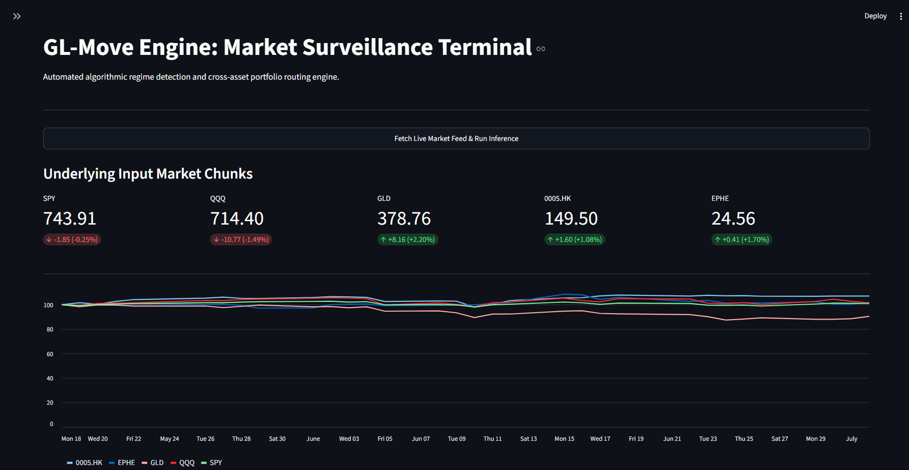
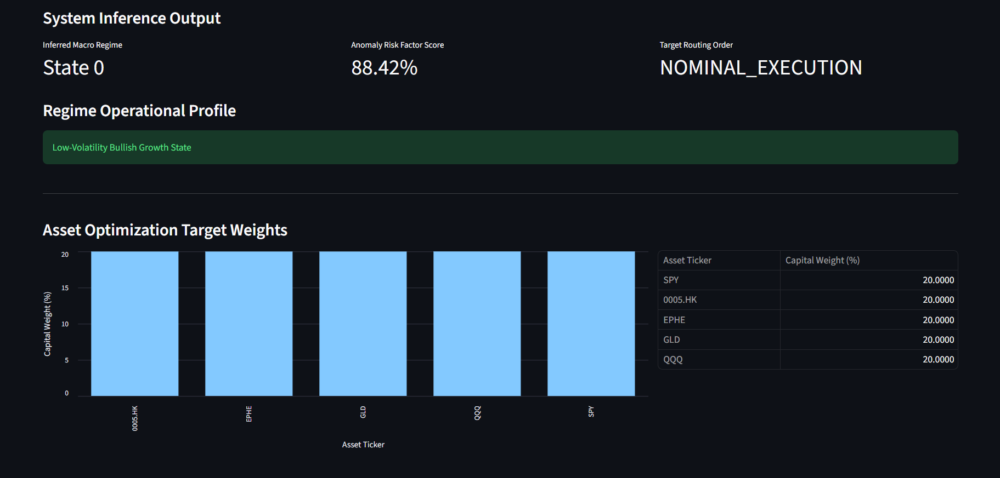
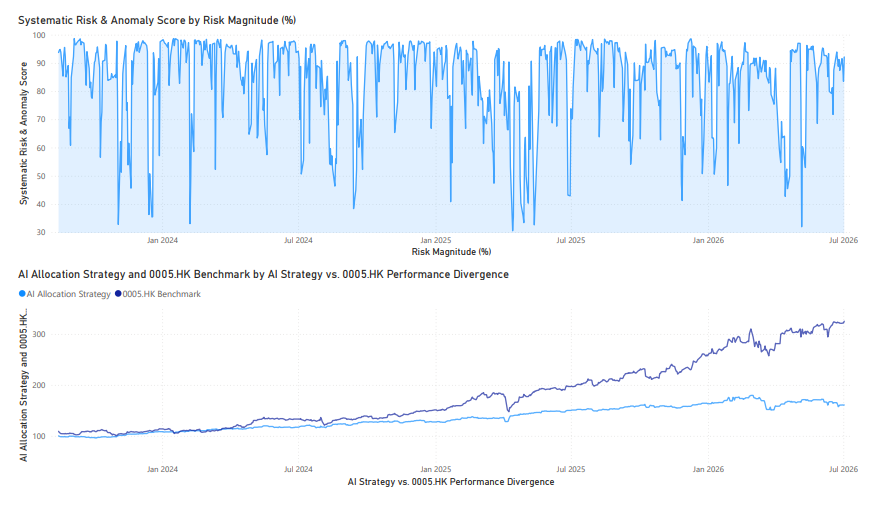
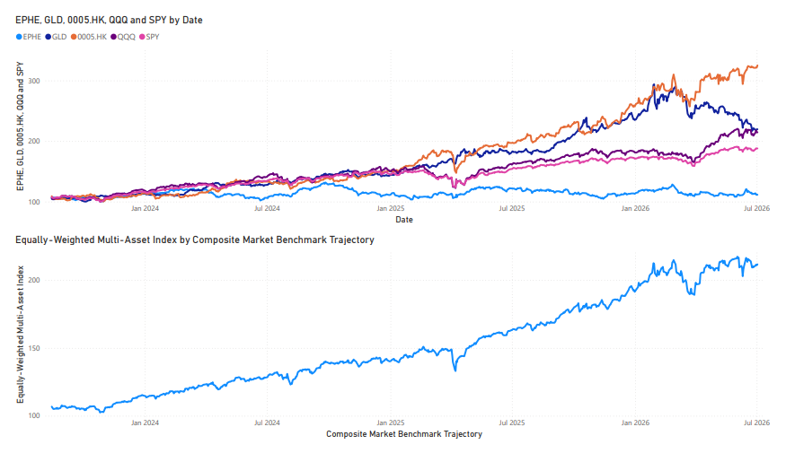

# GL-Move Engine: Macro-Regime Classification & Surveillance Framework

The GL-Move Engine is a high-frequency, unsupervised quantitative framework engineered for real-time market state identification and structural anomaly detection. By bridging the gap between statistical manifold learning and ensemble-based density estimation, the engine provides a robust mechanism for dynamic portfolio risk mitigation across diverse asset classes.

---

## 1. System Architecture & Core Problem Resolution

### 1.1 Multi-Ticker Data Fragmentation

Traditional market surveillance setups suffer from severe data fragmentation, requiring risk managers to analyze disparate, siloed streams for individual assets. The GL-Move Engine resolves this friction by ingestion-level concatenation, consolidating a multi-asset universe (comprising **0005.HK, EPHE, GLD, QQQ, and SPY**) into a single, unified multidimensional matrix. This structural formulation reduces broad market noise into a singular mathematical output while remaining fully scalable to accommodate an arbitrary number of arbitrary tickers.

### 1.2 Base-100 Normalization & Temporal Windowing

The framework targets a 32-day sliding window initialized via live asset data streams. To ensure cross-asset comparability and eliminate valuation discrepancies caused by heterogeneous currency denominations or nominal asset pricing (e.g., comparing 1 HKD in 0005.HK directly against 1 USD in GLD), the engine implements a **Base-100 Normalization** routine. This re-indexes all prices to a standardized scale at $t=0$ for each rolling window:

$$
X_{base} = \left( \frac{X_t}{X_{start}} \right) \times 100
$$

### 1.3 Dimensionality Reduction (PCA)

Following base normalization, Principal Component Analysis (PCA) projects the $d$-dimensional feature space down to an orthogonal $k$-dimensional subspace to eliminate multicollinearity and isolate systemic variance:

$$
\Sigma = \frac{1}{n-1} (X_{base} - \bar{x})^T (X_{base} - \bar{x})
$$

- **Cumulative Variance Captured**: 45.74%
- **Final Components**: 3

### 1.4 Unsupervised Regime Partitioning (K-Means)

The compressed structural matrix is partitioned into $K=4$ macro environments using K-Means clustering. The optimization architecture minimizes the Within-Cluster Sum of Squares (WCSS) to establish strict spatial boundaries:

$$
J = \sum_{j=1}^{k} \sum_{x \in C_j} ||x - \mu_j||^2
$$

### 1.5 Ensemble Surveillance (XGBoost)

The predictive surveillance layer utilizes an XGBoost architecture. Trained on the mathematical intersections of rolling statistical features and stabilized historical state outputs, it provides out-of-sample regime classification to flag anomalous systemic dislocations.

---

## 2. Quantitative Performance Metrics

The system achieves robust risk-adjusted returns by shifting target allocations dynamically based on the active structural market state.

| Metric | Strategic Performance |
|--------|-----------------------|
| **Annualized Strategic Return** | 19.03% |
| **Annualized Volatility Risk** | 11.98% |
| **Strategy Sharpe Ratio** | 1.5878 |
| **Strategy Sortino Ratio** | 2.1455 |
| **Maximum Timeline Drawdown** | -12.14% |
| **Cumulative Capital Multiplier** | 1.97x |

---

## 3. Regime Profile Matrix

The following table defines the analytical asset behaviors observed within each identified cluster centroid:

| Regime ID | Days Allocated | Ann. Return | Ann. Volatility | Max Drawdown |
|-----------|---------------:|------------:|----------------:|-------------:|
| **Regime 0** | 102 | -59.85% | 19.09% | -10.70% |
| **Regime 1** | 477 | 5.92% | 10.27% | -9.19% |
| **Regime 2** | 309 | 55.63% | 10.29% | -7.43% |
| **Regime 3** | 12 | 267.84% | 13.54% | 0.00% |

---

## 4. Operational Surveillance & Human-in-the-Loop Protocol

While the framework compresses cross-asset data into a singular operational regime classification signal, the architecture explicitly enforces a **Human-in-the-Loop (HITL)** operational philosophy.

Relying solely on an automated model output creates blind spots during black-swan structural breaks or liquidity anomalies. It is vital for risk professionals to look past the consolidated mathematical metric and monitor the raw live streams of individual assets. This guarantees a granular, macro-level grasp of microstructural shifts happening across specific regions and asset types simultaneously.

- **Total Timesteps Scanned**: 871 Days
- **Structural Anomalies Detected**: 46 Days
- **Portfolio Anomaly Rate**: 5.28%
- **Surveillance Classification Accuracy (Out-of-Sample)**: 74.86%

---

## 5. Visualized Infrastructure

### Streamlit Operational Interface

The interactive interface queries the live `yfinance` API directly. Upon triggering the execution action, the application fetches live prices for all 5 tickers, constructs the 32-day feature arrays, executes real-time pipeline inference, and returns active dispatch signals along with granular individual asset monitoring charts.




### Power BI Analytical Dashboard

The historical business intelligence engine maps execution telemetry and performance metrics over extended backtest periods to evaluate long-horizon stability.




---

## 6. Directory Structure

The operational repository organizes production scripts away from research sandboxes to secure mathematical reproducibility:

```text
GL-MOVE-ENGINE/
├── api/                  # Production inference endpoints
├── data/                 # Raw/Processed data stores
├── frontend/             # Streamlit operational UI (app.py, generate_history.py)
├── ML/
│   └── 02-Unsupervised-Learning/
│       ├── models/       # PCA/K-Means/XGBoost artifacts
│       ├── notebooks/    # Reproducibility research notebooks
│       └── src/          # Experimental modules (data_utils, model_pipeline)
├── src/                  # Core engine production logic
│   ├── components/       # Reusable UI/Data logic
│   ├── portfolio/        # Portfolio backtester
│   ├── surveillance/     # Live XGBoost inference
│   └── utils/            # Data orchestration (yfinance ingestion, rolling window)
├── main.py               # Production entry point
└── requirements.txt
```